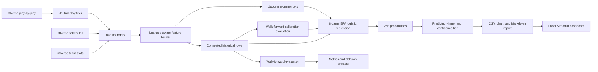

# System architecture

The project is intentionally a small, inspectable batch pipeline. The same feature
builder is used for historical evaluation and weekly predictions so the training and
prediction paths share the same leakage controls.

## Trust boundaries

- `nflreadpy` is the external data boundary. Schema changes should fail explicitly.
- Only completed games contribute team statistics to historical features.
- The feature builder shifts each team’s statistics before rolling aggregation.
- Upcoming schedule rows receive the latest available team history but never a target
  score or same-game statistic.
- The model emits probabilities; the confidence tier is a presentation label, not a
  calibrated guarantee.

## Entry points

- `scripts/build_features.py` materializes a historical feature table.
- `scripts/run_ablations.py` compares feature groups and rolling windows.
- `scripts/predict_week.py` refreshes history, predicts upcoming games, and writes
  weekly artifacts.
